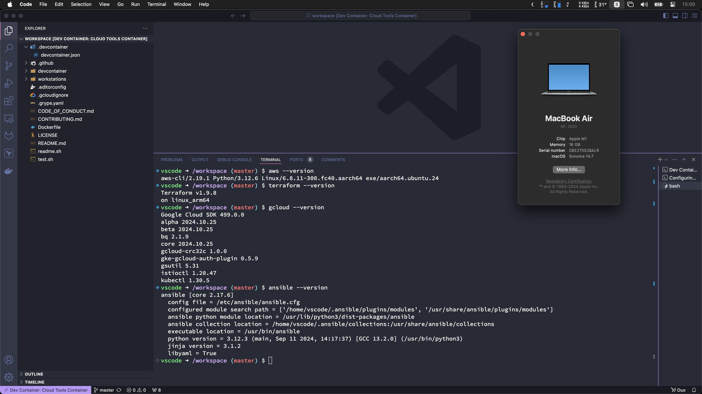
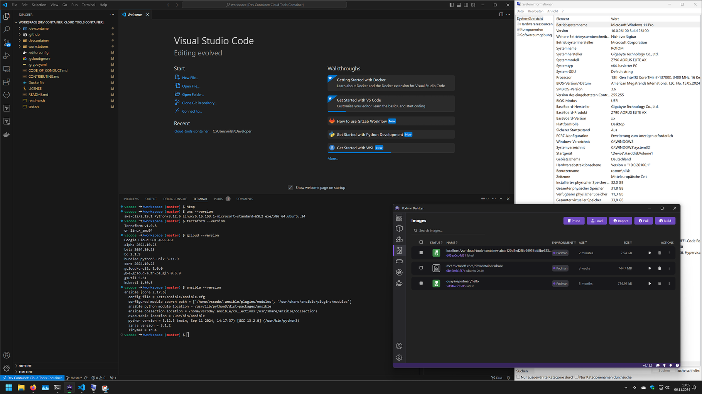

# Development Containers

Cloud Tools Container image optimized for [Development Containers](https://containers.dev/).
Based on [Ubuntu](https://github.com/devcontainers/images/tree/main/src/base-ubuntu) base image from Microsoft.

| macOS                             | Windows                             |
|-----------------------------------|-------------------------------------|
|  |  |

**Multiarch support:**

This Cointainer image supports two CPU architectures `amd64` and `arm64`.
You can therefore use it on a PC with Intel or AMD 64-Bit CPU (x86-64)
and a Mac with a Arm-based 64-Bit CPU (i.e. Apple silicon).

## Example

You can just reference the image directly in `devcontainer.json` for the settings to take effect:

```json
{
  "image": "ghcr.io/cyclenerd/cloud-tools-container:dev"
}
```

## Prerequisites

To get started, you'll need these tools:

* [Visual Studio Code](https://code.visualstudio.com/): A popular code editor.
* [Remote Development Extension Pack](https://marketplace.visualstudio.com/items?itemName=ms-vscode-remote.vscode-remote-extensionpack): This extension allows you to work directly inside containers.
* [Podman](https://podman.io/) or [Docker](https://www.docker.com/products/docker-desktop/): Containerization tools for running your development environment.

### Podman

Podman is an open-source, OCI-compliant container management tool that offers a Docker-like experience without the need for a daemon.
This makes it a secure and lightweight alternative for managing containers.

To install, use the packet manager (recommended) of your operating system or follow the [official guide](https://podman.io/).

<details>
<summary><b>macOS</b></summary>

Run the following commands:

```bash
brew install podman
brew install --cask podman-desktop
```
</details>

<details>
<summary><b>Debian/Ubuntu</b></summary>

Run the following commands:

```bash
sudo apt install podman
```
</details>

<details>
<summary><b>Windows</b></summary>

Open `PowerShell` or Windows Command Prompt in administrator mode by right-clicking and selecting "Run as administrator",
enter the `wsl --install` command, then restart your machine.

```powershell
wsl --install
```

Follow the [Podman for Windows Guide](https://github.com/containers/podman/blob/main/docs/tutorials/podman-for-windows.md) to install Podman CLI.

</details>

After installing, you need to create and start your first Podman machine:

```bash
podman machine init
podman machine start
```

Adjust your Visual Studio Code settings to run `podman` instead of `docker` and `podman-compose` instead of `docker-compose`.

Update the Docker Path setting (via `Dev > Containers: Docker Path` in the Settings editor) to `podman`:

```json
{
    "dev.containers.dockerPath": "podman",
    "dev.containers.dockerComposePath": "podman-compose"
}
```

More help: <https://code.visualstudio.com/remote/advancedcontainers/docker-options#_podman>

**Why Containers?**

Using containers ensures a consistent and reproducible development environment. This means that your code will work the same way on your local machine, your CI/CD pipeline, and in production.

## Open

Try it out with the `Dev Containers: Reopen in Container` command:


