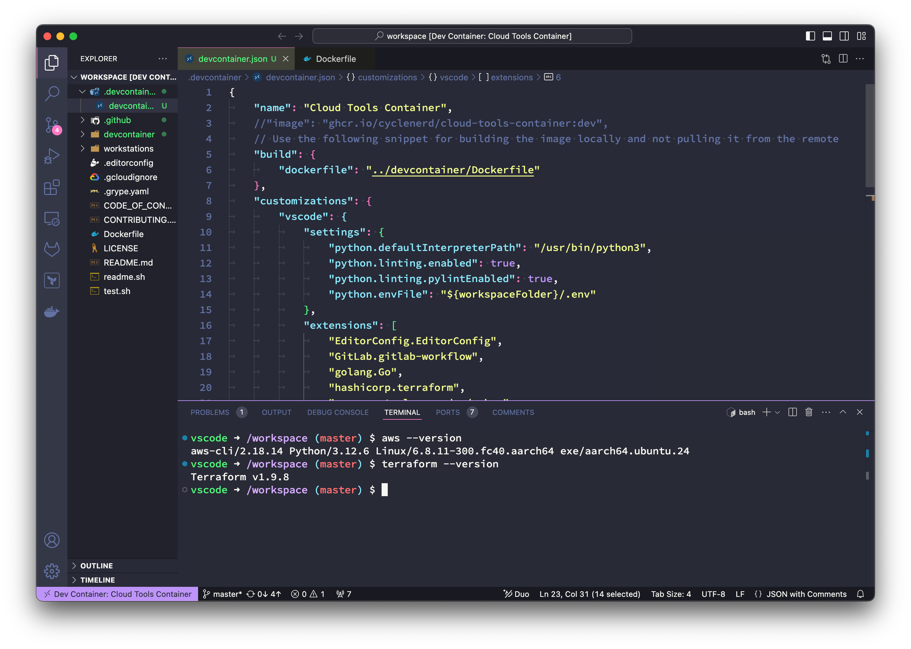

# Development Containers

Cloud Tools Container image optimized for [Development Containers](https://containers.dev/).
Based on [Ubuntu](https://github.com/devcontainers/images/tree/main/src/base-ubuntu) base image from Microsoft.



**Multiarch support:**

This Cointainer image supports two CPU architectures `amd64` and `arm64`.
You can therefore use it on a PC with Intel or AMD 64-Bit CPU (x86-64)
and a Mac with a Arm-based 64-Bit CPU (i.e. Apple silicon).

## Example

You can just reference the image directly in `devcontainer.json` for the settings to take effect:

```json
{
  "image": "ghcr.io/cyclenerd/cloud-tools-container:dev"
}
```

## Prerequisites

To get started, you'll need these tools:

* [Visual Studio Code](https://code.visualstudio.com/): A popular code editor.
* [Remote Development Extension Pack](https://marketplace.visualstudio.com/items?itemName=ms-vscode-remote.vscode-remote-extensionpack): This extension allows you to work directly inside containers.
* [Podman](https://podman.io/) or [Docker](https://www.docker.com/products/docker-desktop/): Containerization tools for running your development environment.

**Why Containers?**

Using containers ensures a consistent and reproducible development environment. This means that your code will work the same way on your local machine, your CI/CD pipeline, and in production.
