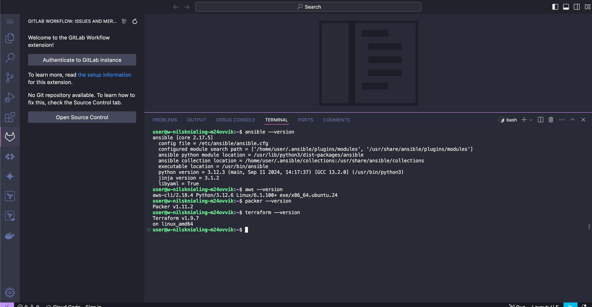
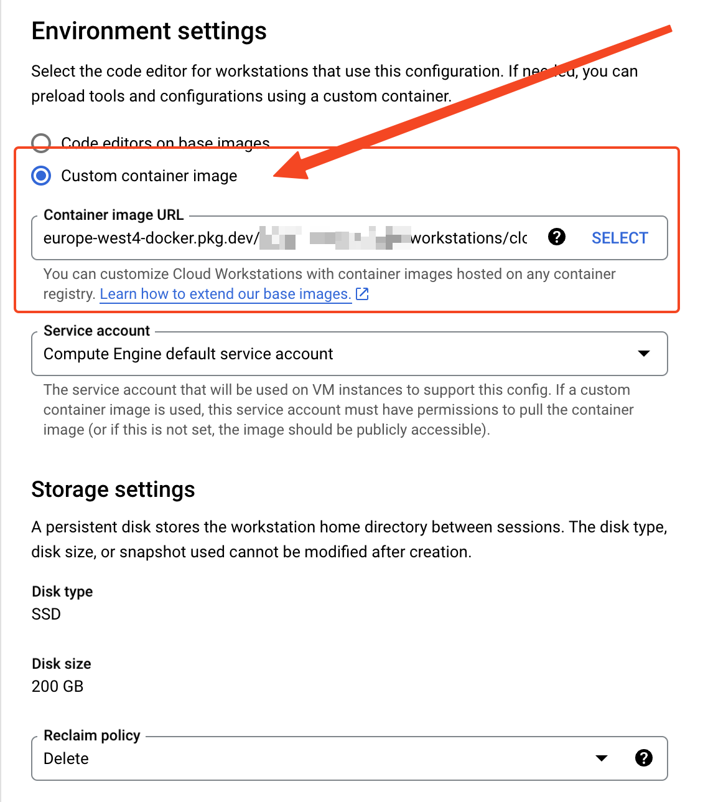

# Cloud Workstations Container

Cloud Tools Container image optimized for Google Cloud Workstations.
Based on [Cloud Workstations base image](https://cloud.google.com/workstations/docs/preconfigured-base-images) from Google.



Google Cloud Workstations are currently only available with `amd64` CPU architecture.
Therefore this container image only supports Intel or AMD 64-Bit CPU (x86-64).

## 1. Build

Create the container image via Google Cloud Build and store the container image in the Google Cloud Artifact Registry.

Example:

```bash
MY_REGION="europe-west4"
MY_ARTIFACT_REPOSITORY="workstations"
MY_PROJECT_ID="[YOUR-PROJECT-ID]"
gcloud builds submit \
    --tag="${MY_REGION}-docker.pkg.dev/${MY_PROJECT_ID}/${MY_ARTIFACT_REPOSITORY}/cloud-tools-container:workstations" \
    --timeout="1h" \
    --project="$MY_PROJECT_ID" \
    --region="$MY_REGION"
```

## 2. Config

Create a Google Cloud Workstations configuration with a custom container image.
Use the custom container image created in Step 1.
Provide the URL to the container image stored in your Google Artifact Registry repository.

Example:



## 3. Run

Start your workstation.
